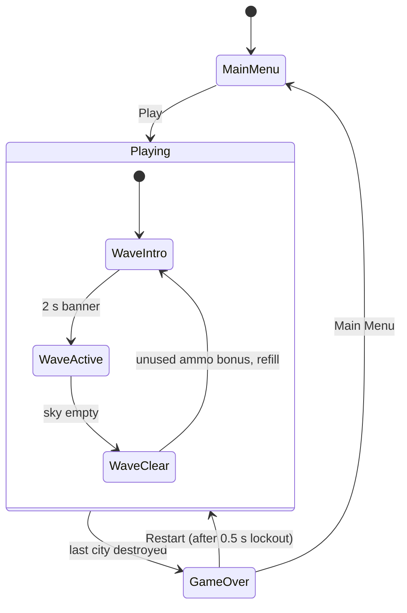
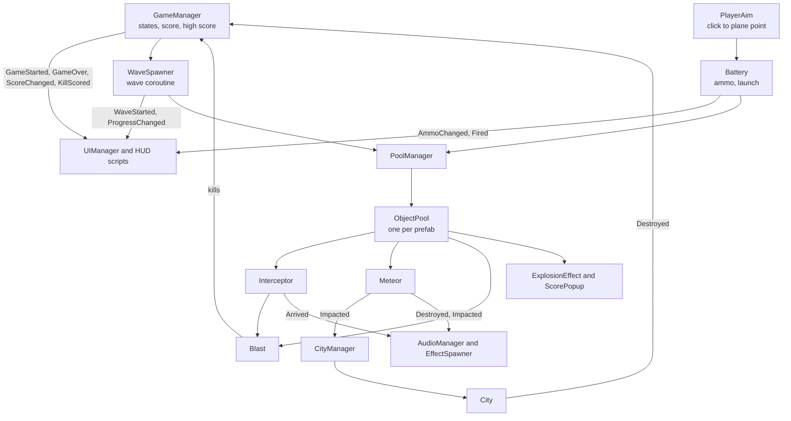

# Game Design Document: *Meteor Command*

| | |
|---|---|
| **Working title** | Meteor Command |
| **Team** | Ilan, Leon |
| **Genre** | Arcade, fixed position area defence, score chaser |
| **Target platform** | PC (Windows), standalone build |
| **Engine / Unity version** | Unity 6 (6000.3.20f1), URP, 3D |
| **Orientation & reference resolution** | Landscape, 1920 x 1080 reference |
| **Expected session length** | 2 to 10 minutes |
| **Document version** | v2.1, 2026-09-21 (v2.0 design brought in line with the finished game, see section 9) |

---

## 1. High Concept

Meteors fall toward six cities. One click sends an interceptor to that point, where it detonates into an expanding sphere that destroys everything inside. A large meteor does not die, it breaks into two smaller ones that keep falling. Ammo is limited each wave, so you protect what matters and let the rest land.

### Design pillars

1. **Every shot is a commitment.** Limited ammo per wave, real interceptor travel time, nothing recalled or re-aimed. *Rules out unlimited ammo, instant hit lasers, homing interceptors, and any undo.*
2. **Breaking a meteor does not solve it.** A large meteor always splits into two that keep falling. Destroy it high and the fragments spread wide of the city; destroy it low and they land on it anyway. *Rules out screen clearing bombs, one hit kill power ups, and anything making a late panic shot as good as an early planned one.*
3. **Readable at a glance.** One fixed play plane, constant meteor speed within a wave, identical blast radius every time, a camera that stays put during play (it only shakes for a moment on an impact and returns to the exact same spot). *Rules out random wind, variable blast sizes, physics bounces, and dynamic cameras.*

---

## 2. Reference & Inspiration

| Mechanics reference: what we take | Art direction target: what we ship |
|---|---|
|  |  |
| *Missile Command* (Atari, 1980). The mechanic we are reworking. **Not the look we are shipping.** | Concept target, not a screenshot. Night sky, flat shaded low poly, emissive glow on blasts and trails. |

- **What we take:** static area denial defence, cities as lives, an ammo economy, the unused ammo bonus at wave clear.
- **What we do not take:** the 2D vector look on a black CRT, the trackball, and the three separate batteries. The visual layer is rebuilt in 3D, and a single battery makes the decision *when* to fire rather than *which* launcher.
- **Deliberately not *Asteroids*:** no player ship, no free movement, no direct fire weapon, no wrap around space. The splitting meteors are a MIRV reskin from Missile Command, not the Asteroids loop.
- **Video of the original being played:** https://www.youtube.com/watch?v=5blsCYd5o_I

---

## 3. Core Game Loop

**The arena.** One invisible vertical plane at Z = 0. Ground runs X = -20 to +20 at Y = 0, with six cities at fixed X positions, three either side of a single battery at X = 0. Meteors enter at Y = 28 across X = -18 to +18. The third dimension is for meshes, lighting and depth only, which is why aiming is never ambiguous in a 3D scene. This is the most important structural decision in the game.

**Moment to moment rules:**

- A click raycasts against the play plane for a target point. The battery fires only if `ammo > 0`, and ammo is spent on launch rather than detonation, so a shot aimed at a meteor something else destroys first is still gone.
- An interceptor travels from the battery at a constant `30 u/s`, passes through everything on the way, and detonates only on arrival. The blast is then a coroutine: expand to `3.0 u` over `0.35 s`, hold `0.15 s`, shrink to zero over `0.35 s`, destroying meteors on trigger enter for the whole `0.85 s`. Every blast has its own id, and the fragments of a Large meteor are immune to the blast that split it, so one blast cannot kill a meteor and its own fragments in the same instant.
- **Spawning and triage.** Each meteor spawns at `Y = 28` at a random X, gets a random ground target X, and travels straight to it. Many head for open ground and are harmless. Only the ones ending near a city need destroying, and reading which those are is what the limited ammo exists to force.
- **Splitting.** Two main tiers. A destroyed **Large** returns to the pool and spawns two **Small**, each rotated off the parent direction by `fragmentSpreadAngle`. A **Small** just dies. Fragments score independently and can be caught in one blast.
- **Tier mix.** Waves 1 and 2 are all Small. From wave 3 each meteor has a `largeMeteorChance` of being Large, starting at 25 percent, rising 10 points per wave, capped at 60.
- **Scout meteor.** From wave 4 a meteor can be a **Scout**: half the size of a Small, purple, twice as fast, and it does not split. Chance 10 percent, rising 5 points per wave, capped at 30.
- **Scoring.** Each meteor is worth 100, and a blast destroying *N* of them scores `100 x N x N`, so two kills is 400 and three is 900. The score is given kill by kill (the Nth kill of one blast is worth `100 x (2N - 1)`), and a floating `+300` shows where each kill happened, bigger and warmer for every extra kill. This is the whole reason to wait for a cluster.
- **Failure and running dry.** A meteor touching the ground destroys the nearest city within `cityKillRadius` (measured along the ground) and is removed, otherwise it is harmless. A destroyed city collapses into a low pile of rubble. The run ends when the sixth city dies. If ammo hits zero mid wave the battery stops firing and the rest land where they land: survivable, not an instant loss. The counter turns red below five shots.
- **Wave clear.** The wave has fully spawned and none are alive. Each unused interceptor awards `+25`, then ammo refills to `ammoPerWave`.

### Parameters you will need to tune

| Parameter | What it controls | Value in the game |
|---|---|---|
| `interceptorSpeed` | How fast a shot reaches its point, so how far ahead you lead | 30 u/s |
| `meteorSpeedBase` | Fall speed on wave 1. Main difficulty dial, traded against `interceptorSpeed` | 6 u/s |
| `meteorSpeedPerWave` | How much faster each wave gets | +0.5 u/s |
| `blastRadius` | How much sky one shot covers, so how forgiving aiming is and how reachable combos are | 3.0 u |
| `blastExpand` / `blastHold` / `blastShrink` | The three phases of the blast coroutine | 0.35 / 0.15 / 0.35 s |
| `ammoPerWave` | Shots per wave, the strategy dial. Lower makes combos mandatory | 20 |
| `meteorsBase` / `meteorsPerWave` | Wave size and its growth | 6 / +3 |
| `largeMeteorChance` / `largeChancePerWave` / `largeChanceCap` | How the Large to Small mix shifts per wave | 25% / +10% / 60% |
| `scoutChance` / `scoutChancePerWave` / `scoutChanceCap` | How often the fast scout appears from wave 4 | 10% / +5% / 30% |
| `fragmentSpreadAngle` | How far a fragment rotates off its parent. Low values make splits trivially re-combo'd | 25 degrees |
| `cityKillRadius` | How close an impact must land to destroy a city | 2.0 u |
| Meteor sizes | Scale of Large, Small and Scout | 4 / 2 / 1 |

**Where these live:** `[SerializeField]` fields under `[Header]` attributes on `WaveSpawner`, `GameManager`, `CityManager` and on the `Meteor`, `Interceptor` and `Blast` prefabs. Deliberately not a ScriptableObject: while the numbers move weekly, one asset fewer to keep in sync beats the indirection.

**Feel target:** a first time player clears wave 1 without losing a city. After ten minutes of practice a player reaches wave 6 and lands a three meteor combo.

---

## 4. Controls & Input

| Action | Keyboard / Mouse | Gamepad | Touch |
|---|---|---|---|
| Fire interceptor at cursor | Left Mouse Button | Not supported | Not supported |
| Confirm menu button | Left Mouse Button | Not supported | Not supported |

- Input is read on press in `Update` with the legacy `Input` class (`Input.GetMouseButtonDown(0)`), converted to a world point via `Camera.main.ScreenPointToRay` against the play plane, then handed to `Battery`. The New Input System package is not used: three inputs, one line each, and its `Active Input Handling` setting is a known source of silent runtime breakage.
- The game state decides whether a click may fire: it does nothing in the menu or on the Game Over screen, so clicking Restart cannot also spend a shot. (An earlier version checked `EventSystem.IsPointerOverGameObject()`, but every text on the HUD blocked clicks under it, so it was removed.)
- On Game Over a `0.5 s` lockout runs before Restart and Main Menu accept a click, so the click that killed you cannot skip past your score.
- Clicks are ignored while the wave banner is on screen, so no ammo is wasted before the player can see the sky.

---

## 5. Screens & UI

1. **Main Menu.** Logo `METEOR COMMAND` with the line `PROTECT WHAT MATTERS`, a `Best` line from the stored high score, buttons `Play` and `Quit`, and three lines of rules printed directly on the menu: click to fire, large meteors split, destroying several at once is worth far more.
2. **HUD during play.** `WAVE 3` and a progress bar that empties as the meteors of the wave are dealt with top left, the score top centre, ammo as `18 / 20` with a row of twenty small missiles bottom centre under the battery, and six building icons bottom left that go dark as cities die. A big `WAVE N` banner shows for two seconds at the start of each wave.
3. **Game Over.** `GAME OVER`, final score, a `NEW BEST!` line when the record is beaten (otherwise the best score), buttons `Restart` and `Main Menu`.

- **Deliberately absent from the HUD:** no minimap, no timer, no combo meter. The score pop up at each kill already shows the multiplier when it matters.
- **Canvas setup:** Screen Space Overlay, CanvasScaler on **Scale With Screen Size**, reference 1920 x 1080, Match = 0.5.

---

## 6. Art & Audio

| Asset | Variants / frames | Source & licence | Use |
|---|---|---|---|
| Meteor | Unity sphere, three sizes, glowing emissive materials (orange, purple for the scout) and a tapered flame trail | Built in | The falling threat |
| City building | Unity cube with a generated window texture (lit windows glow through an emission map), and a dark rubble material | Made by us (generated PNG) | Destructible targets |
| Battery / launcher | Unity cube | Built in | Player structure |
| Interceptor | Unity sphere with a smoke trail | Built in | The player's shot |
| Blast | Unity sphere with a custom URP shader: a see-through bubble with a glowing rim, plus a short point light | Made by us (shader) | The detonation volume |
| Explosion VFX | One pooled prefab, five particle layers built in code: sparks, ring, fireball, smoke, debris | Made by us | Destruction effect |
| Icons | Building and missile icons, button frame, soft dot particle | Made by us (generated PNGs) | HUD and UI |
| Background | Two night sky images: Milky Way with low poly mountains, and a lake with moon, clouds and far city lights | Generated with ChatGPT image generation | Staging and depth |
| Ground | Flat plane with a dark blue material | Built in | Arena floor |
| Fonts | Orbitron and Bebas Neue | Google Fonts, SIL Open Font License | All UI text |
| SFX and music | Launch, blast, ground impact, city lost, wave start, game start, game over jingle, one music loop; a synthesised retro sound is used for a kill | Pixabay (dennish18, dragon-studio, freesound_community, chrysalyn) | Audio feedback |

**Licence note:** every asset is either made by us, built into Unity, under the SIL Open Font License, or from Pixabay's free licence, so the build and the public repo ship as they are. Nothing is taken from image search. The credits are also listed in the README.

**Technical art rules:** URP Lit for solid meshes, URP Unlit with emission for trails, lit windows and particles. One directional key light in moonlight blue, a dark blue ambient colour, and a short lived point light per blast. Bloom on the global volume makes everything emissive glow. Real time lighting only, no baking: everything meaningful moves, so a lightmap would bake nothing useful. Target 60 FPS.

---

## 7. Technical Design

**Scenes:** one, `Game.unity`. Menu and game over are Canvas panels toggled by `UIManager`. Restart reloads the same scene, resetting everything at once instead of each system needing its own reset path.

**Packages:** URP, TextMeshPro. No Input System package, no Cinemachine, no third party tweening.

**Target device:** Windows 10 or 11 desktop at 1920 x 1080, the laptop we demo on.

**Architecture.** Scripts talk to each other mostly through C# events, so the UI, audio and effects never need to know how the game logic works.

| Script | Responsibility |
|---|---|
| `GameManager` | State machine (menu, playing, game over), score, high score, city count check. The only script that ends a run. |
| `WaveSpawner` | One coroutine that runs the waves: banner pause, spawn N meteors on an interval, wait for the sky to clear, award the bonus. Also reports the wave progress. |
| `PoolManager`, `ObjectPool` | One pool per prefab (meteors, interceptors, blasts, effects, pop ups), handed out by type. |
| `PlayerAim` | Turns a click into a point on the play plane and asks the battery to fire. |
| `Battery` | Spends ammo and launches an interceptor at a target point. |
| `Interceptor` | Travels to its point, returns itself to the pool, spawns a blast there. |
| `Meteor` | Falls to its ground target. A Large spawns two Small when destroyed, a Scout does not split. |
| `Blast` | Runs the expand, hold and shrink coroutine, counts kills, reports the combo. `BlastLight` adds the point light. |
| `City`, `CityManager` | A city collapses into rubble and reports it. The manager finds the nearest city to an impact. |
| `UIManager` | Shows and hides the three panels, updates score, wave, ammo, and handles the buttons. `WaveBanner`, `WaveProgress`, `CityIcons` and `AmmoIcons` drive the rest of the HUD. |
| `AudioManager` | Plays a sound for each game event. `AudioTrim` cuts silence and caps clip length, `SfxSynth` makes a fallback retro sound in code. |
| `EffectSpawner`, `ExplosionEffect`, `ScorePopup`, `TrailStyle` | Visual feedback: explosions, floating score numbers and trails. |
| `CameraShake` | A coroutine that offsets the camera on impact, then restores it exactly. |
| `BackgroundFit` | Sizes the background picture to always fill the camera view. |

### The course features we are implementing

1. **Object pooling** (`PoolManager`, `ObjectPool`). Meteors, interceptors, blasts, effects and score pop ups are pooled at 80, 25, 25, 30 and 20. A late wave spawns many meteors and every Large destroyed adds two fragments mid wave, so `Instantiate` and `Destroy` traffic would peak exactly when the screen is busiest. A GC spike while the player is leading a shot is a death they did not earn, breaking pillar 3.
2. **Coroutines** (`Blast`, `WaveSpawner`, `CameraShake`, `WaveBanner`, `ScorePopup`, `ExplosionEffect`). A blast is three timed phases in sequence, exactly what a coroutine expresses; in `Update` it needs a timer float and a phase enum per instance. `WaveSpawner` sequences banner, spawn, wait, bonus and next wave as straight line code instead of a per frame state machine.
3. **Singleton** (`GameManager`, `PoolManager`, `CityManager`). Scene scoped, `Instance = this` in `Awake`, deliberately no `DontDestroyOnLoad`: with one scene there is nothing to persist across, and it would leave a duplicate manager after every restart. A pooled `Meteor` holds no serialized references, so it needs a global route to the pool and the cities.
4. **Events (observer pattern).** Static C# events such as `City.Destroyed`, `GameManager.GameOver`, `WaveSpawner.WaveStarted` and `Battery.AmmoChanged`. Publishers never know who is listening, so HUD, audio and effects can be added or removed without touching the game logic. Every subscriber unsubscribes in `OnDisable`.
5. **Prefabs and Inspector tuning.** Every number above is a `[SerializeField]` under a `[Header]`, so the feel can be retuned mid playtest without a recompile.

---

## 8. Scope

### 8.1 MVP, the game is not a game without these

- [x] One battery, six cities, flat arena, all gameplay on the Z = 0 plane
- [x] Click, interceptor travels, expanding blast destroys meteors inside it
- [x] Meteors fall to ground targets, destroy a city on impact, run ends when the last city dies
- [x] Large meteors split into two Small when destroyed
- [x] Limited ammo per wave plus the unused ammo bonus
- [x] Combo scoring for multiple kills in one blast
- [x] Object pooled meteors, interceptors and blasts
- [x] Waves growing in count, speed and Large share
- [x] All three panels with a working restart

### 8.2 Polish, if the MVP is done and playable

- [x] Trail Renderer on meteors and interceptors
- [x] Emissive materials with URP Bloom, so blasts, trails and city windows glow
- [x] Explosion VFX (built by us with particle layers instead of the Unity Particle Pack)
- [x] Camera shake on ground impact
- [x] Layered low poly mountains (from the background image; no distance fog)
- [x] Full audio pass: launch, blast, impact, city lost, wave start, game start, game over, music (no menu click sound)
- [x] Floating score pop up showing each combo value
- [x] Persistent high score via `PlayerPrefs`
- [x] A fast scout meteor at double speed that does not split

### 8.3 Explicitly out of scope, we are **not** building these

- Mobile builds, touch input, or any mobile performance target
- Gamepad support
- Anything online: multiplayer, leaderboards, cloud saves
- Destructible or repairable batteries, and multiple batteries
- Physics driven debris, destructible terrain, or curving trajectories. Meteors travel straight, always
- Any save beyond a single `PlayerPrefs` high score
- More than one Unity scene
- Three or more meteor tiers. Two only (plus the scout, which does not split), because the ammo economy does not survive a deeper split tree
- A pause menu (not built)

---

## 9. Differences from the approved v2.0 design

The design was approved on 2026-09-06. While building it we kept every pillar and every rule, and changed the following:

- **Meshes:** meteors, cities and the battery are simple Unity shapes with glowing materials and a generated window texture, not the planned Kenney kits.
- **VFX and sound:** the explosion is built by us in code instead of the Unity Particle Pack. Sound and music come from Pixabay instead of Freesound.
- **HUD layout:** we followed the concept image. Ammo is shown as a number plus a row of missiles, the cities as building icons, and the wave progress as a bar. The score is in the top centre.
- **Wave index:** it lives in `WaveSpawner` (which uses it for every wave rule) and not in `GameManager`.
- **`AudioManager`:** it is not a singleton. It listens to game events, so no other script has to call it.
- **Click handling:** the game state decides if a click may fire, instead of `IsPointerOverGameObject` (see section 4).
- **Camera shake and coroutines:** the shake stays a coroutine as planned, and coroutines are also used for the wave banner, the score pop ups and the effect lifetime.
- **Additions:** scout meteor, score pop ups, blast fragments immune to their own blast, city rubble, blast point light, and a second background.
- **Not built:** pause menu and distance fog.

---

## Changelog

| Version | Date | Change |
|---|---|---|
| v0.1 | 2026-08-15 | Initial outline |
| v1.0 | 2026-09-01 | First full draft as *Missile Command 3D* |
| v2.0 | 2026-09-06 | Reworked as *Meteor Command* against the course template: splitting meteors, combo scoring and a per wave ammo economy. Set to two meteor tiers after three did not fit the ammo budget. Scope trimmed to three panels |
| v2.1 | 2026-09-21 | Brought in line with the finished game: real numbers, HUD and screens, assets and credits, scout meteor and other additions, checklists ticked, differences listed in section 9. Moved to `Docs/GDD.md` |
