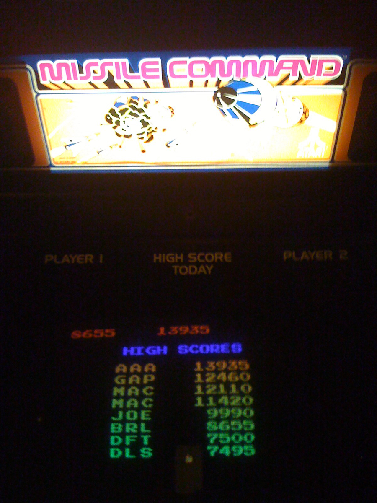
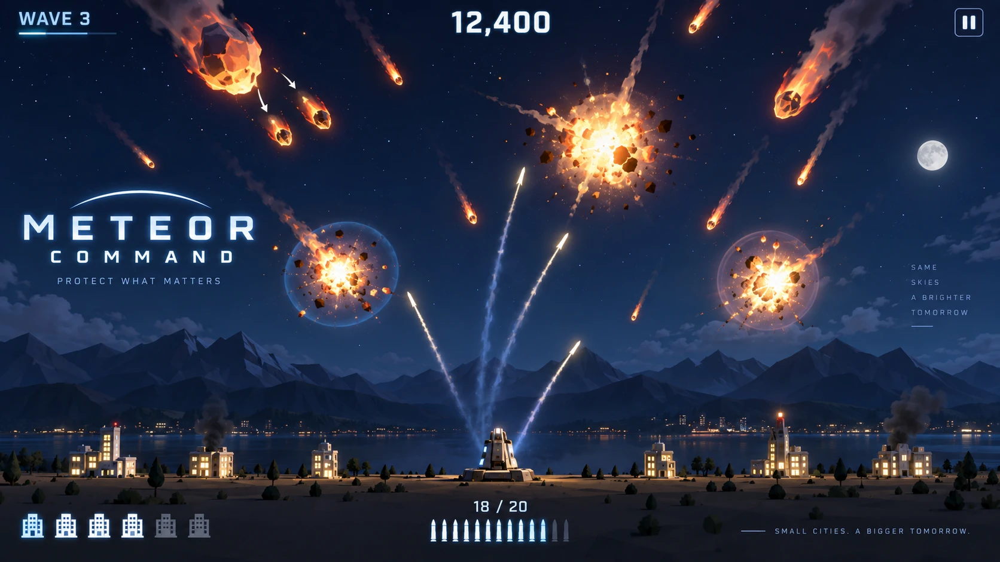
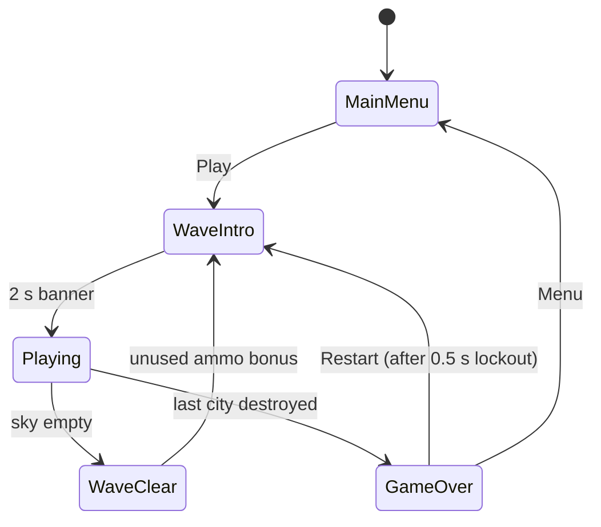
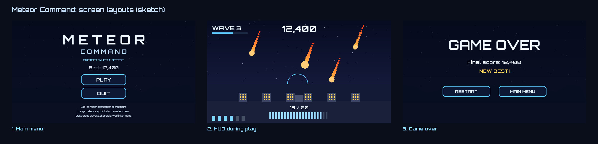
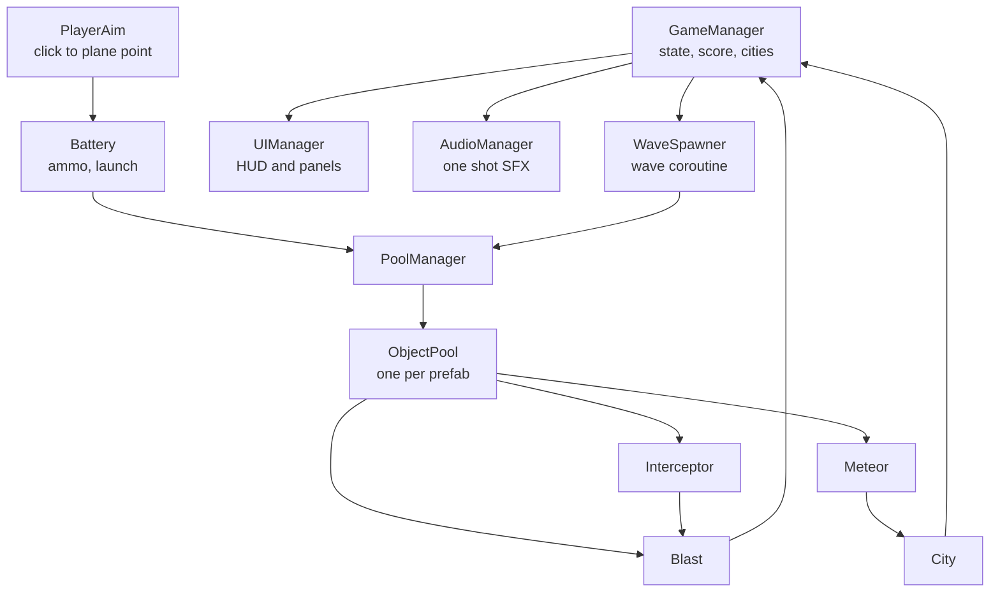

# Game Design Document: *Meteor Command*

| | |
|---|---|
| **Working title** | Meteor Command |
| **Team** | Ilan, Leon |
| **Genre** | Arcade, fixed position area defence, score chaser |
| **Target platform** | PC (Windows), standalone build |
| **Engine / Unity version** | Unity 6 (6000.3.20f1), URP, 3D |
| **Orientation & reference resolution** | Landscape, 1920 x 1080 reference |
| **Expected session length** | 2 to 10 minutes |
| **Document version** | v2.1, 2026-09-26 |

---

## 1. High Concept

Meteors fall toward six cities. One click sends an interceptor to that point, where it detonates into an expanding sphere that destroys everything inside. A large meteor does not die, it breaks into two smaller ones that keep falling. Ammo is limited each wave, so you protect what matters and let the rest land.

### Design pillars

1. **Every shot is a commitment.** Limited ammo per wave, real interceptor travel time, nothing recalled or re-aimed. *Rules out unlimited ammo, instant hit lasers, homing interceptors, and any undo.*
2. **Breaking a meteor does not solve it.** A large meteor always splits into two that keep falling. Destroy it high and the fragments spread wide of the city; destroy it low and they land on it anyway. *Rules out screen clearing bombs, one hit kill power ups, and anything making a late panic shot as good as an early planned one.*
3. **Readable at a glance.** One fixed play plane, constant meteor speed within a wave, identical blast radius every time, a camera that never moves during play. *Rules out random wind, variable blast sizes, physics bounces, and dynamic cameras.*

---

## 2. Reference & Inspiration

| Mechanics reference: what we take | Art direction target: what we ship |
|---|---|
|  |  |
| *Missile Command* (Atari, 1980). The mechanic we are reworking. **Not the look we are shipping.** | Concept target, not a screenshot. Night sky, flat shaded low poly, emissive glow on blasts and trails. |

- **What we take:** static area denial defence, cities as lives, an ammo economy, the unused ammo bonus at wave clear.
- **What we do not take:** the 2D vector look on a black CRT, the trackball, and the three separate batteries. The visual layer is rebuilt in 3D, and a single battery makes the decision *when* to fire rather than *which* launcher.
- **Deliberately not *Asteroids*:** no player ship, no free movement, no direct fire weapon, no wrap around space. The splitting meteors are a MIRV reskin from Missile Command, not the Asteroids loop.
- **Video of the original being played:** https://www.youtube.com/watch?v=5blsCYd5o_I

---

## 3. Core Game Loop

**The arena.** One invisible vertical plane at Z = 0. Ground runs X = -20 to +20 at Y = 0, with six cities at fixed X positions, three either side of a single battery at X = 0. Meteors enter at Y = 28 across X = -18 to +18. The third dimension is for meshes, lighting and depth only, which is why aiming is never ambiguous in a 3D scene. This is the most important structural decision in the game.

**Moment to moment rules:**

- A click raycasts against the play plane for a target point. The battery fires only if `ammo > 0`, and ammo is spent on launch rather than detonation, so a shot aimed at a meteor something else destroys first is still gone.
- An interceptor travels from the battery at a constant `30 u/s`, passes through everything on the way, and detonates only on arrival. The blast is then a coroutine: expand to `3.0 u` over `0.35 s`, hold `0.15 s`, shrink to zero over `0.35 s`, destroying meteors on trigger enter for the whole `0.85 s`.
- **Spawning and triage.** Each meteor spawns at `Y = 28` at a random X, gets a random ground target X, and travels straight to it. Many head for open ground and are harmless. Only the ones ending near a city need destroying, and reading which those are is what the limited ammo exists to force.
- **Splitting.** Two tiers only. A destroyed **Large** returns to the pool and spawns two **Small**, each rotated off the parent direction by `fragmentSpreadAngle`. A **Small** just dies. Fragments score independently and can be caught in one blast.
- **Tier mix.** Waves 1 and 2 are all Small. From wave 3 each meteor has a `largeMeteorChance` of being Large, starting at 25 percent, rising 10 points per wave, capped at 60.
- **Scoring.** Each meteor is worth 100, and a blast destroying *N* of them scores `100 x N x N`, so two kills is 400 and three is 900. This is the whole reason to wait for a cluster.
- **Failure and running dry.** A meteor reaching `Y = 0` destroys the nearest city within `cityKillRadius` and is removed, otherwise it is harmless. The run ends when the sixth city dies. If ammo hits zero mid wave the battery stops firing and the rest land where they land: survivable, not an instant loss. The counter turns red below five shots.
- **Wave clear.** The wave has fully spawned and none are alive. Each unused interceptor awards `+25`, then ammo refills to that wave's ammo budget (see `extraAmmoFraction` below).

### Parameters you will need to tune

| Parameter | What it controls | First guess |
|---|---|---|
| `interceptorSpeed` | How fast a shot reaches its point, so how far ahead you lead | 30 u/s |
| `meteorSpeedBase` | Fall speed on wave 1. Main difficulty dial, traded against `interceptorSpeed` | 6 u/s |
| `meteorSpeedPerWave` | How much faster each wave gets | +0.5 u/s |
| `blastRadius` | How much sky one shot covers, so how forgiving aiming is and how reachable combos are | 3.0 u |
| `blastExpand` / `blastHold` / `blastShrink` | The three phases of the blast coroutine | 0.35 / 0.15 / 0.35 s |
| `extraAmmoFraction` | Ammo for a wave is that wave's meteor count plus this fraction, rounded up. The strategy dial: lower makes combos mandatory. A fixed shot count stopped working once later waves threw more meteors than it, so this scales with the wave instead | 25% |
| `meteorsBase` / `meteorsPerWave` | Wave size and its growth | 6 / +3 |
| `largeMeteorChance` / `largeChancePerWave` / `largeChanceCap` | How the Large to Small mix shifts per wave | 25% / +10% / 60% |
| `fragmentSpreadAngle` | How far a fragment rotates off its parent. Low values make splits trivially re-combo'd | 25 degrees |
| `cityKillRadius` | How close an impact must land to destroy a city | 2.0 u |

**Where these live:** `[SerializeField]` fields on `GameManager` and `WaveSpawner` under `[Header]` attributes. Deliberately not a ScriptableObject: while the numbers move weekly, one asset fewer to keep in sync beats the indirection.

**Feel target:** a first time player clears wave 1 without losing a city. After ten minutes of practice a player reaches wave 6 and lands a three meteor combo.

---

## 4. Controls & Input

| Action | Keyboard / Mouse | Gamepad | Touch |
|---|---|---|---|
| Fire interceptor at cursor | Left Mouse Button | Not supported | Not supported |
| Confirm menu button | Left Mouse Button | Not supported | Not supported |

- Input is read on press in `Update` with the legacy `Input` class (`Input.GetMouseButtonDown(0)`), converted to a world point via `Camera.main.ScreenPointToRay` against the play plane, then handed to `Battery`. The New Input System package is not used: three inputs, one line each, and its `Active Input Handling` setting is a known source of silent runtime breakage.
- If the cursor is over a UI element (`EventSystem.current.IsPointerOverGameObject()`) the click is consumed by the UI and never reaches `Battery`, so clicking Restart on the Game Over screen cannot also spend a shot in the run it starts.
- On Game Over a `0.5 s` lockout runs before Restart accepts a click, so the click that killed you cannot skip past your score.
- Clicks are ignored during the wave intro banner and the wave clear bonus, so no ammo is wasted before the player can see the sky.

---

## 5. Screens & UI

1. **Main Menu.** Title `METEOR COMMAND`, buttons `Play` and `Quit`, a `Best: 12,400` line from the stored high score, and three lines of rules printed directly on the menu: click to fire, large meteors split, destroying several at once is worth far more.
2. **HUD during play.** Score top centre, `WAVE 3` and a progress bar top left, ammo as `18 / 20` bottom centre under the battery, and six city icons bottom left that grey out as cities die.
3. **Game Over.** `GAME OVER`, final score, a `NEW BEST!` line when the record is beaten, buttons `Restart` and `Main Menu`.

- **Deliberately absent from the HUD:** no minimap, no timer, no combo meter. The score pop up at each blast already shows the multiplier when it matters.
- **Canvas setup:** Screen Space Overlay, CanvasScaler on **Scale With Screen Size**, reference 1920 x 1080, Match = 0.5.

---

## 6. Art & Audio

| Asset | Variants / frames | Source & licence | Use |
|---|---|---|---|
| Meteor mesh | 1 rock mesh, 2 tiers at scale 1.0 and 0.5 | Kenney *Nature Kit* (CC0) | The falling threat |
| City building | 6 low poly blocks plus 1 rubble variant | Kenney *City Kit (Commercial)* (CC0) | Destructible targets |
| Battery / launcher | 1 turret mesh | Kenney *Tower Defense Kit* (CC0) | Player structure |
| Blast sphere | Unity sphere, emissive transparent URP material | Built in | The detonation volume |
| Explosion VFX | 1 prefab, recoloured to the night palette | Unity *Particle Pack* (free) | Destruction effect |
| Ground, sky | Flat plane; one wide night sky picture behind everything | Built in; sky image made with AI image generation (credited in the README) | Staging and depth |
| SFX launch | 1 clip | Freesound.org (CC0) | Battery fires |
| SFX blast | 2 clips, alternated | Freesound.org (CC0) | Detonation |
| SFX ground impact | 1 clip | Freesound.org (CC0) | Meteor hits the ground |
| SFX city lost | 1 clip | Freesound.org (CC0) | A city is destroyed |
| Music | 1 loop | Freesound.org (CC0) | Menu and play |

**Licence note:** every asset is CC0 or Unity Asset Store free licence, so the build and the public repo ship as they are. Any CC-BY track used is credited in the README. Nothing is taken from image search.

**Technical art rules:** URP Lit for solid meshes, URP Unlit with emission for blasts, trails and lit windows. One directional key light plus a short lived point light per blast. Real time lighting only, no baking: everything meaningful moves, so a lightmap would bake nothing useful while still costing build time. Target 60 FPS, meshes under 500 triangles.

---

## 7. Technical Design

**Scenes:** one, `Game.unity`. Menu and game over are Canvas panels toggled by `UIManager`. Restart calls `SceneManager.LoadScene` on the same scene, resetting everything at once instead of each system needing its own reset path.

**Packages:** URP, TextMeshPro. No Input System package, no Cinemachine, no third party tweening.

**Target device:** Windows 10 or 11 desktop at 1920 x 1080, the laptop we demo on.

**Architecture:**

| Script | Responsibility |
|---|---|
| `GameManager` | State machine, score, wave index, city count. The only script that ends a run. |
| `WaveSpawner` | One coroutine per wave: spawn N meteors on an interval, wait for the sky to clear, award the bonus. |
| `PoolManager` | Holds one `ObjectPool` per prefab and hands out instances by type. |
| `ObjectPool` | Pre-instantiates a fixed count of one prefab and recycles them, growing only if starved. |
| `PlayerAim` | Turns a click into a point on the play plane and asks the battery to fire. |
| `Battery` | Spends ammo and launches an interceptor at a target point. |
| `Interceptor` | Travels to its point, returns itself to the pool, spawns a blast there. |
| `Meteor` | Falls to its ground target. On death a Large spawns two Small, a Small dies. |
| `Blast` | Runs the expand, hold and shrink coroutine, counts kills, reports the combo. |
| `City` | Takes one impact, swaps to its rubble mesh, reports the loss. |
| `UIManager` | Updates score, wave, ammo and city icons, shows and hides the three panels. |
| `AudioManager` | Plays one shot SFX so no caller needs its own `AudioSource`. |
| `CameraShake` | A coroutine that offsets the camera on impact, then restores it exactly. |

### The course features we are implementing

1. **Object pooling** (`PoolManager`, `ObjectPool`). Meteors, interceptors and blasts pooled at 80, 25 and 25. A late wave spawns 24 meteors and every Large destroyed adds two fragments mid wave, so `Instantiate` and `Destroy` traffic peaks exactly when the screen is busiest. A GC spike while the player is leading a shot is a death they did not earn, breaking pillar 3.
2. **Coroutines** (`Blast`, `WaveSpawner`, `CameraShake`). A blast is three timed phases in sequence, exactly what a coroutine expresses; in `Update` it needs a timer float and a phase enum per instance. `WaveSpawner` sequences spawn, wait, bonus and next wave as straight line code instead of a per frame state machine.
3. **Singleton** (`GameManager`, `PoolManager`, `AudioManager`). Scene scoped, `Instance = this` in `Awake`, deliberately no `DontDestroyOnLoad`: with one scene there is nothing to persist across, and it would leave a duplicate manager after every restart. A pooled `Meteor` holds no serialized references, so it needs a global route to score and audio.
4. **Prefabs and Inspector tuning.** Every number above is a `[SerializeField]` under a `[Header]`, so the feel can be retuned mid playtest without a recompile.

---

## 8. Scope

### 8.1 MVP, the game is not a game without these

- [ ] One battery, six cities, flat arena, all gameplay on the Z = 0 plane
- [ ] Click, interceptor travels, expanding blast destroys meteors inside it
- [ ] Meteors fall to ground targets, destroy a city on impact, run ends when the last city dies
- [ ] Large meteors split into two Small when destroyed
- [ ] Limited ammo per wave plus the unused ammo bonus
- [ ] Combo scoring for multiple kills in one blast
- [ ] Object pooled meteors, interceptors and blasts
- [ ] Waves growing in count, speed and Large share
- [ ] All three panels with a working restart

### 8.2 Polish, if the MVP is done and playable

- [ ] Trail Renderer on meteors and interceptors
- [ ] Emissive materials with URP Bloom, so blasts, trails and city windows glow. Highest visual payoff per hour in the project
- [ ] Explosion VFX from the free Unity Particle Pack, recoloured to the night palette
- [ ] Camera shake on ground impact
- [ ] Full audio pass: launch, blast, impact, city lost, wave start, menu clicks, music
- [ ] Floating score pop up showing each combo value
- [ ] Persistent high score via `PlayerPrefs`
- [ ] A fast scout meteor at double speed that does not split

### 8.3 Explicitly out of scope, we are **not** building these

- Mobile builds, touch input, or any mobile performance target
- Gamepad support
- Anything online: multiplayer, leaderboards, cloud saves
- Destructible or repairable batteries, and multiple batteries
- Physics driven debris, destructible terrain, or curving trajectories. Meteors travel straight, always
- Any save beyond a single `PlayerPrefs` high score
- More than one Unity scene
- Three or more meteor tiers. Two only, because the ammo economy does not survive a deeper split tree

---

## Changelog

| Version | Date | Change |
|---|---|---|
| v0.1 | 2026-08-15 | Initial outline |
| v1.0 | 2026-09-01 | First full draft as *Missile Command 3D* |
| v2.0 | 2026-09-06 | Reworked as *Meteor Command* against the course template: splitting meteors, combo scoring and a per wave ammo economy. Set to two meteor tiers after three did not fit the ammo budget. Scope trimmed to three panels |
| v2.1 | 2026-09-26 | Ammo per wave (`extraAmmoFraction`) now scales with that wave's meteor count instead of a fixed 20, since later waves outgrew the fixed number. Dropped the layered mountains and distance fog: the sky is one AI-generated picture instead, and there is no longer any layered geometry for fog to read against |
